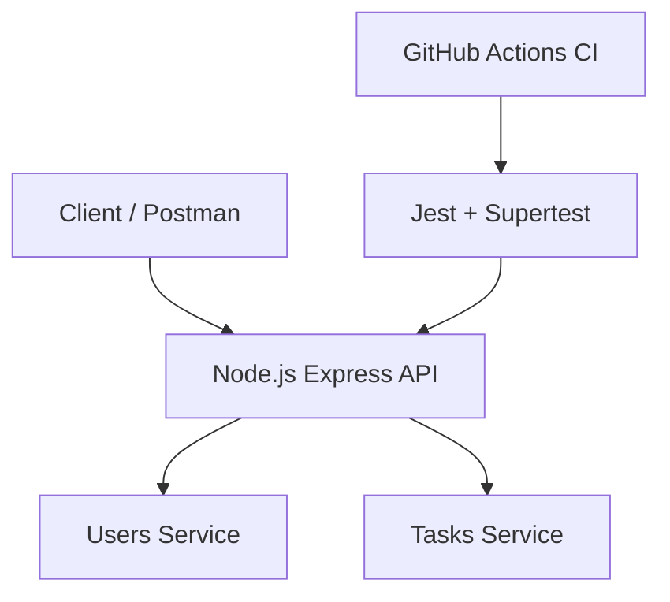

# Node.js API Project

Навчальний проєкт з дисципліни  
**«Розробка програмного забезпечення на платформі Node.js»**

---

## 📌 Опис проєкту
Даний проєкт реалізує REST API з використанням **Node.js** та **Express**.
Архітектура побудована за модульним принципом і складається з двох сервісів:
- **Users Service**
- **Tasks Service**

Кожен сервіс містить по **3 HTTP-роути**.  
Для забезпечення якості коду реалізовано автоматичні тести та CI pipeline.

---

## 🚀 Технології
- **Node.js (LTS)**
- **Express**
- **Jest**
- **Supertest**
- **GitHub Actions (CI)**

---

### 👤 Users Service
- `GET /users` — отримати список користувачів  
- `GET /users/:id` — отримати користувача за ID  
- `POST /users` — створити нового користувача  

### ✅ Tasks Service
- `GET /tasks` — отримати список завдань  
- `GET /tasks/:id` — отримати завдання за ID  
- `POST /tasks` — створити нове завдання  

---

## 🧪 Тестування
Для тестування API використовується **Jest + Supertest**.

Запуск тестів:

```bash
npm test
```
---

## 📂 Структура проєкту

src/
├── app.js
├── routes/
│ ├── users.routes.js
│ └── tasks.routes.js
├── services/
│ ├── users.service.js
│ └── tasks.service.js
└── tests/
├── users.test.js
└── tasks.test.js

.github/
└── workflows/
└── ci.yml

---

## 🔄 CI/CD
У проєкті реалізований **CI pipeline** з використанням **GitHub Actions**.

Pipeline автоматично запускається при кожному `push` у репозиторій та:
- встановлює залежності
- запускає автоматичні тести

---

## 🧩 Архітектурна діаграма



## ▶️ Запуск проєкту

```bash

npm install
npm run dev

```